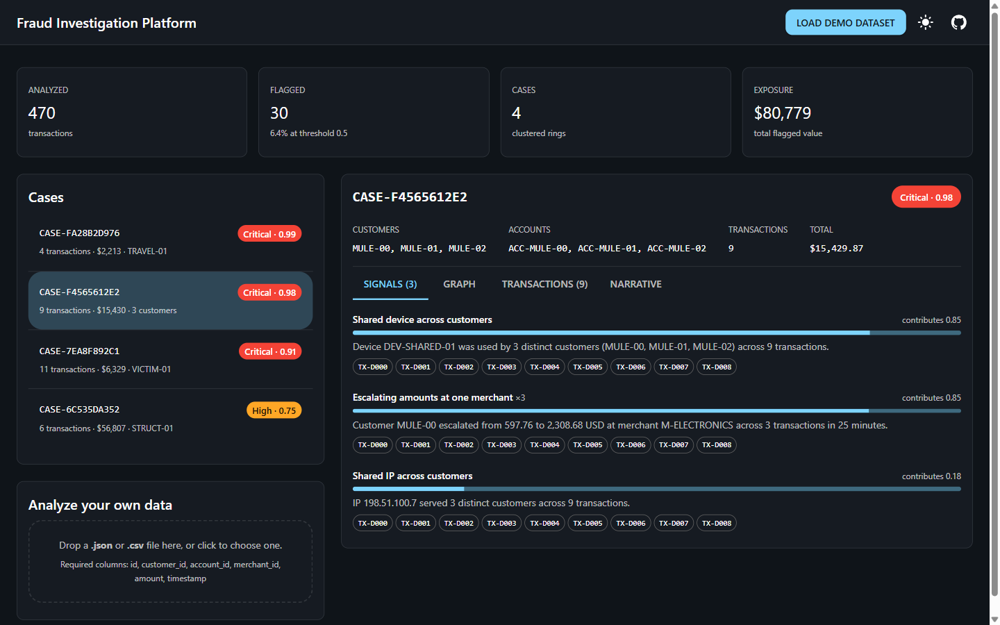
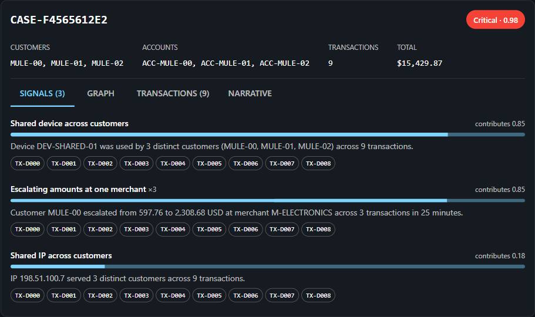
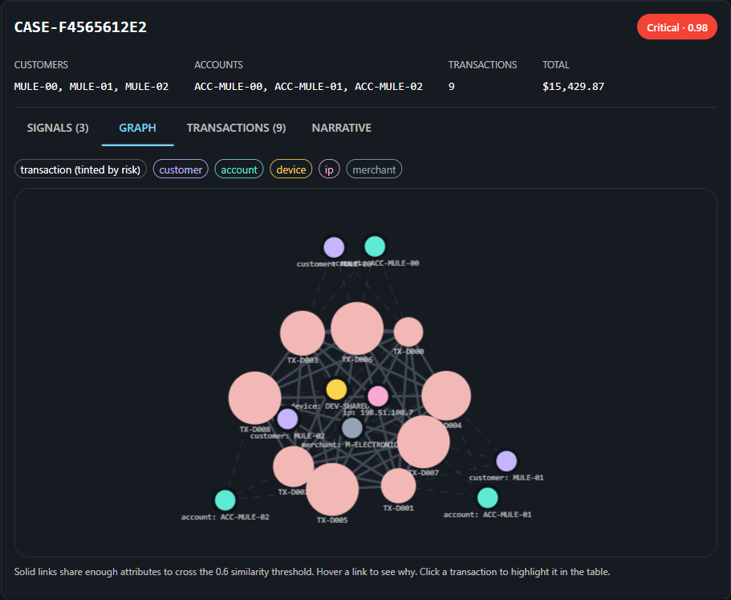
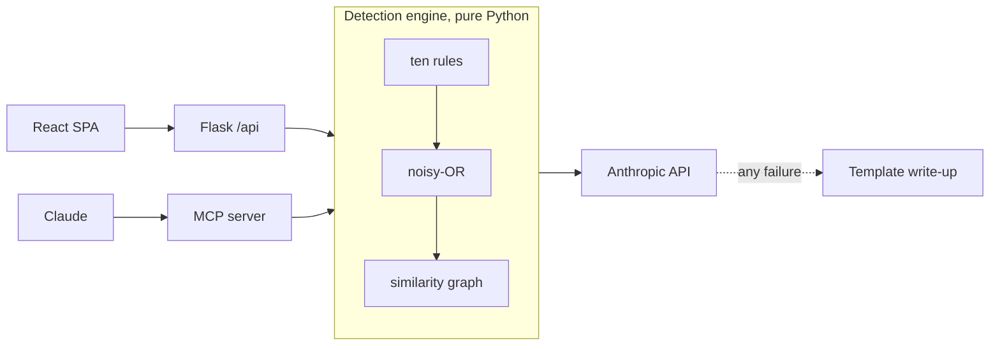

# Fraud Investigation Platform

Finds coordinated fraud rings in transaction data, groups them into cases, and shows the evidence behind every score.

### [Try it here](https://parthpatel2211.github.io/FraudDetectionAgent/)

[](https://github.com/parthpatel2211/FraudDetectionAgent/actions/workflows/ci.yml)
[](https://www.python.org/)
[](LICENSE)

Press "Load demo dataset" and you get four fraud cases with their evidence, their graphs, and their write-ups. The hosted demo runs on GitHub Pages, which serves files and nothing else, so the detection engine there ran at build time rather than when you clicked. Uploading your own data needs the API, which means running it locally or deploying the Vercel config.



## What it does

Give it a batch of transactions and it scores each one against ten rules. The rules are ordinary code: shared devices, impossible travel between countries, small charges followed by a large one, amounts parked just below a reporting threshold. Each rule that fires writes a sentence explaining itself, with the numbers that set it off already in the sentence.

Transactions that clear the threshold then get grouped. Fraud rings show up in what transactions have in common rather than in any single row, so the ones sharing a device or an address end up in the same case instead of arriving as nine separate alerts nobody connects.

Each case can be written up by Claude into something an analyst can act on. That part needs an API key. Everything else does not.

## Why it stopped using machine learning

The first version used an Isolation Forest. Replacing it is the main engineering decision in this project, and the reasoning is worth setting out.

The model was fitted on whatever batch arrived in the request, then a threshold was taken at the 98th percentile of the resulting scores. That flags the top two percent of any batch. Send it four perfectly ordinary transactions and it still reports fraud, because two percent of something is always something. There was no way for it to say a batch looked clean, which is the answer most batches deserve.

The scores had the same shape of problem. A case scored its mean anomaly divided by the batch maximum, so the worst case in any batch came out near one by construction. The badge in the interface read "Critical" every single time. A number that means "worst thing here" is not a risk score, it is a ranking wearing a risk score's clothes.

There was also a crash waiting. Features came from one-hot encoding the channel column, so the width of the feature vector depended on which channels happened to appear. A model fitted on card and web payments would raise on the first batch containing a transfer.

Rules avoid all of this by being boring. Each has a fixed weight, the weights combine the same way every time, and a batch with nothing suspicious in it produces no cases. A score means the same thing on Tuesday as it did on Monday.

What I did not expect was that it made the product better rather than only safer. A forest can tell you a transaction is unusual but not why, and "unusual" is not something an analyst can act on. A rule already knows why it fired, so the explanation comes free and lands in the interface next to the number.

## How a score is built

Every rule returns a strength between zero and one, and carries a weight that caps how much it can contribute.

| Rule | Weight | Fires when |
|---|---|---|
| Geographically impossible sequence | 0.90 | One customer transacting in two countries less than four hours apart |
| Shared device across customers | 0.85 | One device fingerprint used by two or more customers |
| Card testing followed by cash-out | 0.80 | Three or more charges under 5 USD, then one over 500 within two hours |
| Amounts just under a reporting threshold | 0.75 | Three or more transfers between 8,500 and 10,000 USD in a day |
| Escalating amounts at one merchant | 0.70 | Rising amounts under fifteen minutes apart, ending at double the start |
| Abnormal transaction velocity | 0.65 | More than five transactions by one customer in ten minutes |
| Shared IP across customers | 0.55 | One address serving three or more customers |
| Amount far outside customer baseline | 0.45 | More than three standard deviations above that customer's own history |
| Burst of first-time merchants | 0.45 | Three or more never-seen merchants within an hour |
| Off-hours activity | 0.25 | Posted between 01:00 and 05:00 UTC |

The bottom two sit below the flag threshold deliberately. A large purchase is a laptop. A three in the morning transaction is somebody who could not sleep. Either one opening a case by itself would bury an analyst in false positives, so both can only raise the score of a case that other evidence already built. On the demo dataset they touch thirteen clean transactions each and flag none of them.

Scores combine with noisy-OR, treating each rule as independent evidence:

```
risk = 1 - product(1 - weight * strength)
```

Taken from the actual output for the shared-device ring:

```
shared device across customers        0.8500
escalating amounts at one merchant    0.8483   (three customers, each escalating)
shared IP across customers            0.1833

risk = 1 - (0.1500 * 0.1517 * 0.8167) = 0.9814
```

Because the operation is associative, a rule that fires several times folds into one contribution without changing the total. That is what lets the evidence list in the interface add up to the number printed on the case, and a test checks it for every case rather than trusting it stays true.

The result is bounded, it never falls when evidence is added, and it does not depend on what else was in the batch. That last property is the one worth having: 0.85 means the same thing in a batch of fifty and a batch of fifty thousand, so a fixed threshold is meaningful and a clean batch can return nothing at all.



## Why the graph exists

Flagged transactions get linked to each other by what they share. A device counts for 0.80, a customer or account or address for 0.50, and a merchant for 0.15. A pair links when the total reaches 0.60.

That merchant weight is the interesting one. Merchant is the single attribute complete strangers routinely share, and weighting it like the others is exactly what the first version did. Because every transaction linked to its merchant node, one popular shop pulled every unrelated customer who had ever bought something there into a single enormous case. At 0.15 a shared merchant cannot link anything by itself. It can only reinforce a connection other evidence already made. Two tests pin this down: forty customers at one merchant produce zero edges.

Buckets bigger than their cap are skipped outright, because a device seen on three hundred transactions is a payment terminal rather than a ring. Pairs are only compared inside a shared attribute, never across the whole batch, so the cost stays close to linear. The worst case, five thousand transactions with every one of them flagged, takes 3.9 seconds.



## Measuring it

The bundled dataset holds 470 transactions, 30 of them fraudulent across four planted rings.

| Threshold | Flagged | Precision | Recall | F1 | Cases |
|---|---|---|---|---|---|
| 0.30 | 33 | 0.909 | 1.000 | 0.952 | 7 |
| 0.40 | 31 | 0.968 | 1.000 | 0.984 | 5 |
| 0.50 | 30 | 1.000 | 1.000 | 1.000 | 4 |
| 0.60 | 30 | 1.000 | 1.000 | 1.000 | 4 |
| 0.70 | 30 | 1.000 | 1.000 | 1.000 | 4 |
| 0.80 | 24 | 1.000 | 0.800 | 0.889 | 3 |

All four rings come back whole, and the thirty flagged transactions land in exactly four cases with nothing crossing between them.

Those numbers deserve a caveat, and a large one. The data is synthetic and I wrote the rules already knowing which patterns the generator plants, so a perfect score measures whether the pipeline works end to end and says nothing about how it would do on real traffic. What the sweep does show is that 0.5 was not picked to flatter the result. There is a plateau from 0.5 to 0.7 and it comes apart sensibly on either side: 0.3 starts admitting false positives, and 0.8 loses the structuring ring, which scores 0.750. On real data every weight and threshold in the table above would need rebuilding against labelled outcomes.

## Writing up a case

An analyst does not want a number, they want a paragraph they can put in a file. Claude produces that from the case evidence using structured output, so there is no free text to parse and nothing to break when the wording drifts.

There is always a fallback. No key, a refusal, a truncated response, a network failure, anything at all, and the case gets a deterministic write-up assembled from the same rule explanations. It is less fluent and it is never absent. The interface says which one produced the text, because a fallback nobody discloses is the kind of thing that makes a reviewer doubt everything else on the page.

<!-- screenshot: the narrative tab, showing the model chip -->

The public demo also rations the paid path. Over the limit you still get a usable summary rather than an error, marked as rate limited.

## How it fits together

The HTTP API and the MCP server are two doors onto one engine. Nothing is implemented twice, so the two cannot drift apart and start disagreeing about what a case is.



### Endpoints

| Method | Path | What it does | Needs a key |
|---|---|---|---|
| `GET` | `/api/health` | Liveness, and whether a model is configured | no |
| `GET` | `/api/demo` | The bundled dataset | no |
| `POST` | `/api/analyze` | Transactions in, cases out | no |
| `POST` | `/api/summarize` | A case in, a write-up out | for the model path |

`/api/analyze` takes a bare array or an object with a `transactions` key, caps the batch at five thousand, and checks the size before parsing so an oversized request costs nothing. A case that comes out of it goes back into `/api/summarize` unchanged, which sounds obvious and was not true of the first version.

## Investigating from Claude

The same engine is an MCP server, so Claude can work a dataset directly.

```bash
fastmcp run backend/mcp_server.py
```

| Tool | What it does |
|---|---|
| `load_demo_dataset` | Loads the bundled 470 transactions |
| `analyze_transactions` | Scores, clusters, returns cases |
| `summarize_case` | Writes up one case |
| `explain_rules` | Weights, the formula, the severity bands |

`explain_rules` is the one that matters. Without it Claude can repeat a score back to you. With it, Claude can tell you why the number is what it is.

Invalid rows are rejected by index rather than skipped. The first version caught the error per row and carried on, so a malformed transaction vanished and the analysis quietly covered fewer rows than were submitted, with nothing anywhere to say so.

<!-- screenshot or clip: Claude chaining the tools -->

## Running it

```bash
git clone https://github.com/parthpatel2211/FraudDetectionAgent.git
cd FraudDetectionAgent
python -m venv .venv && .venv/Scripts/pip install -r requirements-dev.txt
```

```bash
cp .env.example .env
.venv/Scripts/python -m backend.app
```

The frontend runs separately:

```bash
cd frontend && npm install && npm run dev
```

Open `http://localhost:5173` and press "Load demo dataset". Vite proxies `/api` to Flask, so there is no CORS to configure and no host to set anywhere.

An API key is optional. Without one every write-up comes from the template and the interface says so. With one, put `ANTHROPIC_API_KEY` in `.env`.

### Tests

```bash
.venv/Scripts/python -m pytest --cov=backend    # 165 tests
ruff check .
cd frontend && npm test                          # 56 tests
```

The interesting ones are regressions rather than coverage. A clean batch has to produce no cases. Forty customers at one merchant have to produce no edges. Analysing batch A, then a batch with a different channel, then batch A again has to give byte-identical results. A failed request must never leave the interface stuck loading, which the first version did, because a rejected fetch threw straight past the line meant to reset it.

### The sample data

The dataset comes from a committed script rather than appearing as a file with no history. You can read what was planted and then watch the tool find it: three customers on one device, a card-testing run, a customer in two countries twenty minutes apart, and six transfers sized to stay under ten thousand.

```bash
.venv/Scripts/python data/generate.py
.venv/Scripts/python scripts/evaluate.py
```

Both are deterministic. The generator takes a seed and anchors on a fixed timestamp, so the committed fixtures do not churn and the evaluation numbers above can be checked rather than believed.

## What it does not do

Nothing is persisted. Cases live for the length of a request and a reload loses them. There is no case status, no assignment, no audit trail, none of the things that separate a detector from something an investigations team could work in.

The rules are hand-tuned. Every weight is a judgement call calibrated against one synthetic dataset, and I would not trust any of them against real traffic without recalibrating first.

It scores batches, not streams. Real fraud detection is a streaming problem and this is not that.

Off-hours means off-hours in UTC, because the data carries no timezone. For a customer in Singapore the rule is measuring the wrong thing.

The rate limiter counts per process, and serverless processes do not share memory, so it is a speed bump rather than a guarantee. The real ceiling is the spend limit on the API key.

The GitHub Pages demo has no backend at all, so uploads and live write-ups only work locally or on Vercel.

## Built with

Python 3.12, Flask, Pydantic, NetworkX, the Anthropic SDK, FastMCP, pytest, and ruff on the backend. React 19, Vite, MUI, react-force-graph-2d, and Vitest on the frontend. GitHub Actions around the outside, with Vercel for the full deployment and GitHub Pages for the static one.

There is no pandas and no scikit-learn. The engine is ordinary Python over dataclasses, which keeps the deployed dependencies at 6.6 MB against roughly 200 MB for the version that imported a modelling stack. That is the difference between fitting in a free serverless tier and not.

Severity colours are defined once and read by the badges, the graph, and the summary tiles, so a case cannot look critical in one place and merely high in another. Transaction nodes in the graph are tinted by their own risk and sized by amount. Links that cleared the similarity threshold are drawn solid and the weaker ones dashed, so you can see which connections actually made the case.

## License

MIT. See [LICENSE](LICENSE).
