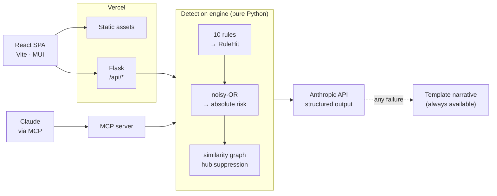

# Fraud Investigation Platform

Detects coordinated fraud rings in transaction data, groups them into cases, and explains
every score it produces.

[](https://github.com/parthpatel2211/FraudDetectionAgent/actions/workflows/ci.yml)

<!-- Live demo: add the deployment URL here once deployed. -->

---

## The problem

Most fraud scoring treats a transaction as an isolated event: score it, threshold it, alert
on it. That catches the careless, and misses the organised.

Coordinated fraud is visible in the *connections* between transactions, not in any single
one of them. Three "customers" whose only shared trait is a device fingerprint. Eight £2
charges that mean nothing alone and everything when followed by a £2,400 one. Six transfers
of £9,400 that are individually unremarkable and collectively a structuring pattern. Score
those rows one at a time and each looks survivable.

The second problem is what an analyst does with a score. A model that says `0.94` and
nothing else cannot be actioned: the analyst still has to reconstruct why, and if they
can't, they either escalate everything or trust nothing.

This project takes the position that a fraud score is only useful if it arrives with its
evidence attached.

## What it does

- **Scores every transaction against ten explainable rules.** Each rule states its own case
  in a sentence containing the numbers that triggered it.
- **Groups flagged transactions into cases** using a transaction-similarity graph, so a ring
  arrives as one investigation rather than nine unrelated alerts.
- **Draws the ring.** The graph is rendered interactively — hover an edge to see which shared
  attribute linked two transactions.
- **Writes the case up** with Claude, using structured output, and falls back to a
  deterministic template whenever the model is unavailable. The UI always says which one
  produced the text.
- **Exposes the same engine over MCP**, so Claude can investigate a dataset conversationally.

## How detection works

### 1. Rules

Every rule returns a score in `[0, 1]` and a `weight` — its maximum contribution to a
transaction's risk.

| Rule | Weight | Fires when |
|------|--------|------------|
| **Geographically impossible sequence** | 0.90 | Consecutive transactions by one customer in different countries less than four hours apart. Full score under one hour, decaying to zero at four. |
| **Shared device across customers** | 0.85 | One device fingerprint used by two or more customers. Devices with more than 20 transactions are treated as shared terminals and skipped. |
| **Card testing followed by cash-out** | 0.80 | Three or more transactions under 5 USD followed within 120 minutes by a charge of at least 500 USD. |
| **Amounts just under a reporting threshold** | 0.75 | Three or more transactions between 8,500 and 10,000 USD by one customer within 24 hours. |
| **Escalating amounts at one merchant** | 0.70 | Strictly increasing amounts at one merchant with gaps under 15 minutes, ending at least double where they started. |
| **Abnormal transaction velocity** | 0.65 | More than 5 transactions by one customer inside any 10-minute sliding window. |
| **Shared IP across customers** | 0.55 | One IP serving three or more customers. Looser than the device rule because households and NAT legitimately share addresses. Skipped above 50 transactions. |
| **Amount far outside customer baseline** | 0.45 | More than three standard deviations above the customer's own baseline, computed leave-one-out. Needs four transactions of history. |
| **Burst of first-time merchants** | 0.45 | Three or more never-before-seen merchants for one customer within 60 minutes. |
| **Off-hours activity** | 0.25 | Transaction between 01:00 and 05:00 UTC. |

**The bottom two weights are below the 0.5 flag threshold on purpose.** A large purchase, or
a 3am coffee, cannot open a case on its own — a detector that alerts on those is a
false-positive machine. They raise the score of a case built on stronger evidence instead.
On the demo dataset each touches 13 clean transactions and neither flags one.

Two rules carry an explicit **hub cap**: a device or IP shared by hundreds of transactions is
shared infrastructure, not a ring, and is skipped rather than scored.

### 2. Combining evidence

Scores combine with **noisy-OR**, treating each hit as independent evidence:

```
risk = 1 − ∏ (1 − weightᵢ × scoreᵢ)
```

Worked example — the shared-device ring (`CASE-F4565612E2`), taken from the actual output:

```
shared_device_ring          → 0.8500
rapid_escalation  (×3)      → 0.8483   three customers each escalating
shared_ip_ring              → 0.1833

risk = 1 − (0.1500 × 0.1517 × 0.8167) = 0.9814
```

A rule that fires several times in one case is folded into a single contribution, also by
noisy-OR. Because the operation is associative, **the contributions shown in the UI
recombine to exactly the score shown on the case** — an analyst can add up the evidence and
land on the number. A test asserts this for every case.

The result is **absolute**: bounded in `[0, 1]`, monotone (more evidence never lowers a
score), and independent of what else is in the batch. That last property is the point — a
score of 0.85 means the same thing in a batch of 50 and a batch of 50,000, so the threshold
is meaningful and the detector can return *nothing* when a batch is clean.

### 3. Grouping into cases

Flagged transactions are linked pairwise by the attributes they share:

| Shared attribute | Contributes |
|---|---|
| `device_id` | 0.80 |
| `customer_id` | 0.50 |
| `account_id` | 0.50 |
| `ip_address` | 0.50 |
| `merchant_id` | **0.15** |

A pair is linked when the total reaches **0.60**, then connected components are split into
communities by greedy modularity.

**Merchant is weighted at 0.15 for a specific reason.** It is the one attribute strangers
routinely share. Weighted like the others, a single popular merchant merges every unrelated
customer who shopped there into one enormous "case" — which is exactly what the earlier
version of this project did. At 0.15 a shared merchant can never link a pair on its own; it
only reinforces a link that other evidence already supports. Two tests pin this down: forty
customers at one merchant produce **zero** edges.

Pairs are only compared inside a shared-attribute bucket, never across the whole batch, so
cost stays near-linear. Worst case at the 5,000-transaction request ceiling, with every row
flagged, is **3.9s**.

## Evaluation

Measured by [`scripts/evaluate.py`](scripts/evaluate.py) against a labelled dataset of 470
transactions, 30 of them fraudulent (6.4%) across four injected rings.

| Threshold | Flagged | Precision | Recall | F1 | Cases |
|-----------|---------|-----------|--------|-------|-------|
| 0.30 | 33 | 0.909 | 1.000 | 0.952 | 7 |
| 0.40 | 31 | 0.968 | 1.000 | 0.984 | 5 |
| **0.50** | **30** | **1.000** | **1.000** | **1.000** | **4** |
| 0.60 | 30 | 1.000 | 1.000 | 1.000 | 4 |
| 0.70 | 30 | 1.000 | 1.000 | 1.000 | 4 |
| 0.80 | 24 | 1.000 | 0.800 | 0.889 | 3 |

Each of the four rings is recovered completely, and the 30 flagged transactions cluster into
exactly four cases with no cross-contamination.

> **Read these numbers honestly.** The data is synthetic and I wrote the rules knowing which
> patterns the generator injects, so this measures *"the pipeline works end to end"*, not
> *"this will get 100% on your traffic"*. What the sweep does show is that 0.5 is not a
> cherry-picked operating point: there is a stable plateau from 0.5 to 0.7, and it degrades
> sensibly on both sides — 0.3 admits false positives, 0.8 starts dropping the structuring
> ring, which scores 0.750. On real traffic every threshold and weight here would need
> recalibrating against labelled outcomes.

## Architecture



The HTTP API and the MCP server are two front doors onto the *same* engine — no duplicated
logic, so they cannot drift apart.

## MCP server

The engine is also an MCP server, so Claude can investigate a dataset directly:

| Tool | Purpose |
|---|---|
| `load_demo_dataset` | Load the bundled 470-transaction dataset |
| `analyze_transactions` | Score, cluster, and return cases |
| `summarize_case` | Write up one case |
| `explain_rules` | Weights, the noisy-OR formula, severity bands |

```bash
fastmcp run backend/mcp_server.py
```

`explain_rules` is what makes the difference between Claude relaying a score and Claude
explaining one.

## Running locally

```bash
git clone https://github.com/parthpatel2211/FraudDetectionAgent.git
cd FraudDetectionAgent
```

Backend:

```bash
python -m venv .venv && .venv/Scripts/pip install -r requirements-dev.txt
```

```bash
cp .env.example .env
```

```bash
.venv/Scripts/python -m backend.app
```

Frontend, in a second terminal:

```bash
cd frontend && npm install && npm run dev
```

Open http://localhost:5173. The Vite dev server proxies `/api` to Flask, so there is no CORS
configuration and no API host to set.

**The Anthropic key is optional.** Without it every summary comes from the deterministic
template and the UI labels it as such. With it, set `ANTHROPIC_API_KEY` in `.env`.

Tests:

```bash
.venv/Scripts/python -m pytest --cov=backend
```

```bash
cd frontend && npm test
```

```bash
.venv/Scripts/python scripts/evaluate.py
```

## Tech stack

**Backend** — Python 3.12, Flask, Pydantic v2, NetworkX, Anthropic SDK, FastMCP.
No pandas, no scikit-learn: the engine is pure Python, which keeps the deployed dependency
set at **6.6 MB** and cold starts short.

**Frontend** — React 19, Vite, MUI 7, react-force-graph-2d.

**Quality** — pytest (97% backend coverage), Vitest (56 tests), ruff, GitHub Actions.

## Project layout

```
backend/
  engine/      context · rules · scoring · graph · detector
  narrative/   template (always) · llm (when a key is set)
  app.py       Flask API
  mcp_server.py
api/index.py   Vercel entrypoint
data/          seeded generator + committed fixtures
scripts/       evaluate.py
frontend/src/  components · hooks · lib
tests/         125 backend tests
```

## Limitations, honestly

- **The data is synthetic.** The generator and the rules were written by the same person, so
  the evaluation demonstrates the pipeline rather than predicting field accuracy.
- **The rules are hand-tuned, not learned.** Every weight and threshold is a judgement call
  calibrated against this dataset. Real deployment needs labelled outcomes and recalibration.
- **No persistence.** Cases live in memory for the duration of a request; reloading loses
  them. There is no case status, no assignment, no audit trail — all of which a real
  investigation tool needs.
- **The rate limiter is per-instance.** Serverless instances do not share state, so it is a
  speed bump. The real cost ceiling is the spend limit on the API key.
- **Batch only.** Real fraud detection is a streaming problem; this scores a batch on demand.
- **Off-hours is UTC.** With no customer timezone, "3am" is an assumption.

## What I would do next

1. Persist cases with status, assignment, and an audit trail — the gap between a detector
   and an investigation tool.
2. Add a supervised layer over the rule outputs once labelled outcomes exist, keeping the
   rules as explainable features rather than replacing them.
3. Move to streaming ingestion with incremental graph updates.
4. Precision/recall tracking per rule over time, so weight drift is visible.
